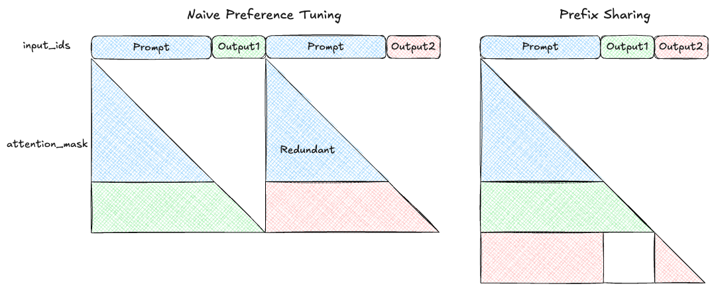
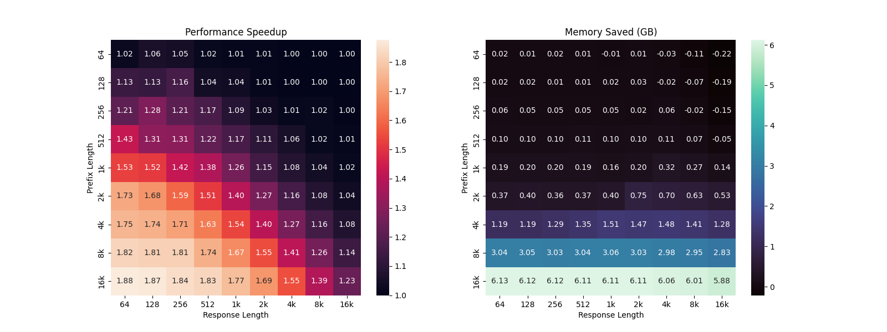

# Flash Preference

[](https://pypi.org/project/flash-pref/)
[](LICENSE)

Accelerate LLM preference tuning via prefix sharing with a single line of code. Applicable to Direct Preference Optimization (DPO), Reward Modeling (RM), Group Relative Policy Optimization (GRPO), etc.



## Getting Started

Install the stable version from PyPI:
```
pip install flash-pref
```

Or install the latest version from GitHub:
```sh
pip install git+https://github.com/li-plus/flash-preference.git@main
```

All you have to do is to add a `shared_prefix` context wrapping the model forward and backward passes. The common prefixes of the input sequences will be automatically detected and shared, reducing computation and memory footprint without loss of accuracy.
```python
import torch
from transformers import AutoModelForCausalLM, AutoTokenizer

from flash_pref import shared_prefix

model_id = "Qwen/Qwen2.5-7B-Instruct"
tokenizer = AutoTokenizer.from_pretrained(model_id, padding_side="right")
model = AutoModelForCausalLM.from_pretrained(
    model_id, attn_implementation="flash_attention_2", use_cache=False, torch_dtype=torch.bfloat16, device_map="cuda"
)

prompt = "What is the next 10 numbers of this sequence: " + ", ".join(str(x) for x in range(500))
chosen_response = ", ".join(str(x) for x in range(500, 500 + 10))
rejected_response = ", ".join(str(x) for x in range(500, 500 + 10, 2))

conversations = [
    [{"role": "user", "content": prompt}, {"role": "assistant", "content": chosen_response}],
    [{"role": "user", "content": prompt}, {"role": "assistant", "content": rejected_response}],
]
inputs = tokenizer.apply_chat_template(
    conversations, tokenize=True, padding=True, return_tensors="pt", return_dict=True
).to("cuda")

# ===== MAGIC HERE =====
with shared_prefix(model, input_ids=inputs.input_ids, attention_mask=inputs.attention_mask):
    output = model(**inputs)
    output.logits.backward(torch.randn_like(output.logits))
```

## Benchmark

The performance speedup and memory saved relative to the baseline:



Benchmark settings are as below. Please refer to [tests/benchmark.py](tests/benchmark.py) for more details.
* Model: [Qwen/Qwen2.5-7B-Instruct](https://huggingface.co/Qwen/Qwen2.5-7B-Instruct) with gradient checkpointing, [Liger-Kernel](https://github.com/linkedin/Liger-Kernel) and [FlashAttention-2](https://github.com/Dao-AILab/flash-attention) enabled.
* Data: mocked pairwise preference data where prompt and response lengths vary from 64 to 16k.
* Computation: 1 forward pass and then 1 backward pass.
* Hardware: 1x NVIDIA A800-SXM4-80GB GPU.

## Developing

**Unit Tests**

Currently tested for LLaMA, Gemma, Gemma2, Qwen2, Qwen2VL and Qwen2.5VL architectures. At least 2 GPUs are required for unit tests. To run the unit tests, type:
```sh
make test
```

**Code Format**

To format the code, type:
```sh
make lint
```

## License

This project is under [MIT License](LICENSE).
